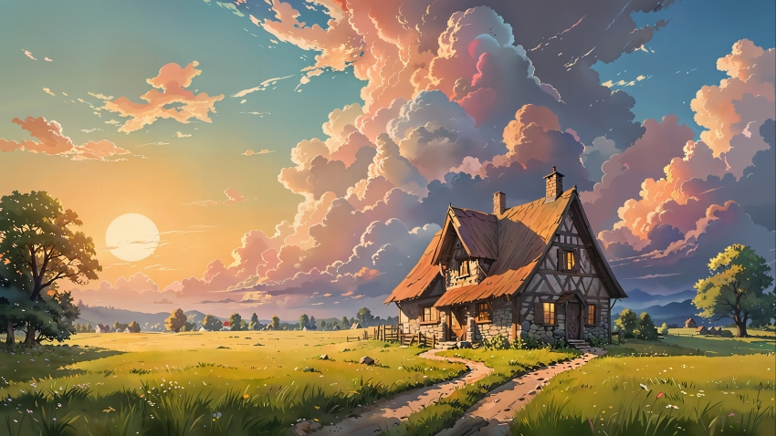
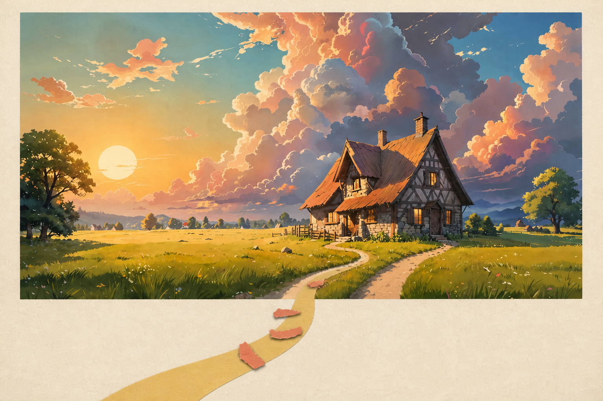

# Paper Scene Skills

> **Experimental / beta.** This is a public, source-available project licensed only for individual, personal, non-commercial use.

Paper Scene Skills is a paired set of Codex skills for turning a supplied photograph into paper-editorial artwork. The pair deliberately separates two routes:

| Skill | Route | Result |
| --- | --- | --- |
| [`paper-scene-collage`](paper-scene-collage/SKILL.md) | Retained-photo collage | Keeps a recognizable photographic region and builds paper, print, color, and illustration around it. |
| [`paper-scene-recompose`](paper-scene-recompose/SKILL.md) | No-photo recompose | Reads the photograph into a text-only blueprint, then generates a new non-photographic illustration without sending the source image to the generation call. |

## Requirements

- Codex with support for local Skills.
- Access to Codex's built-in `image_gen` capability. Local image inspection also uses `view_image` when available.
- For retained-photo generation on Windows, the bundled sanitizer requires Windows PowerShell and `System.Drawing`; it rejects inputs larger than 50 MiB or 50 megapixels as a resource guard, although decoding still occurs in-process. On other systems, supply an already sanitized image or an equivalent locally verified sanitizer.
- Permission to process every supplied image under the active Codex and image-generation service terms.

These Skills are instructions for Codex, not a standalone image model or deterministic compositor. Tool availability, service limits, and data handling depend on the Codex environment in which they run.

## Install the pair

Install **both Skills together**. Their route guards refer to one another, and installing only one removes the intended retained-photo/no-photo choice.

From this repository's root on macOS or Linux:

```bash
mkdir -p ~/.codex/skills
cp -R paper-scene-collage paper-scene-recompose ~/.codex/skills/
```

On Windows PowerShell:

```powershell
New-Item -ItemType Directory -Force "$HOME\.codex\skills" | Out-Null
Copy-Item -Recurse paper-scene-collage, paper-scene-recompose "$HOME\.codex\skills"
```

Restart Codex if the Skills do not appear immediately.

## Use

Attach a photograph, choose the route, and state the relationship, content, or wording that matters.

```text
Use $paper-scene-collage on this photo. Keep the two people and the shoreline recognizable, and build a restrained paper-editorial composition around them.
```

```text
Use $paper-scene-recompose on this photo. Do not retain photo pixels; reinterpret the gesture and distance as a new flat paper illustration.
```

For an ambiguous request, invoke `$paper-scene-collage`; it will ask whether the final result should retain a photographic region or be redrawn without photo pixels.

## Example

This illustrative source image is used to show the difference between the two routes. It is artwork rather than a photograph, so it is not evidence of photographic or pixel-faithful retention.



| Retained-source collage | Source-free recompose |
| --- | --- |
|  |  |
| Keeps the source scene recognizable while integrating it into a paper composition. | Rebuilds the scene as new non-photographic forms without sending the source image to the generation call. |

These are examples from one stochastic generation run, not promised or exactly reproducible outputs. Image provenance, rights, metadata handling, and license scope are documented in [EXAMPLES_NOTICE.md](EXAMPLES_NOTICE.md).

## Important limitations

1. **Generation is stochastic.** Repeated runs can differ, and a prompt or source image does not guarantee a particular composition, identity, object count, spelling, or detail.
2. **Generative edits are not pixel-faithful.** The collage route aims for recognizable retention but cannot promise unchanged pixels, exact identity, exact typography, or exact product geometry. Use a deterministic compositor when those properties must be verified.
3. **Protect private data.** Images may be processed by the configured Codex and `image_gen` services. Do not submit confidential, sensitive, regulated, or identifying material unless you are authorized and accept the applicable service policies. This project makes no claim of zero retention.
4. **You are responsible for image rights.** Confirm copyright, license, consent, privacy, publicity, trademark, and other rights for source photos, style references, people depicted, requested text, and any public sharing. Third-party images are not made lawful merely by being transformed, and generated output may still require rights review.

## License and permitted use

The repository is public but **the combined package is not offered as open source under an OSI-approved license**. The rewritten and newly authored contributions are made available only under the personal, non-commercial conditions in the root [LICENSE](LICENSE). Commercial, paid, client, employer, company, nonprofit, institutional, government, or other organizational use of the package as distributed is prohibited unless separately authorized by every relevant rights holder. Upstream licensing requests must be directed to Zeejay0 as specified in the LICENSE; requests concerning the independently authored contributions may be raised with the maintainer. Neither party can grant rights it does not own.

An immutable public historical snapshot reviewed during development carried an MIT notice, preserved verbatim at [LICENSES/UPSTREAM-MIT.txt](LICENSES/UPSTREAM-MIT.txt). That notice applies only to material actually covered by it; it does not license this repository's rewritten or newly authored contributions. Version provenance, modification identification, and important uncertainty about the public fork evidence are documented in [THIRD_PARTY_NOTICES.md](THIRD_PARTY_NOTICES.md). No notice in this repository expands rights beyond the material to which that notice applies.

This section is a practical summary, not legal advice. The license texts and notices control; users remain responsible for determining whether their intended use is permitted.

## Source, relationship, and disclosure

This project was inspired by the upstream [gathered-scenes-zine-skill](https://github.com/Zeejay0/gathered-scenes-zine-skill) project and was developed after reviewing its public materials. The two-Skill concept and paper-editorial direction informed this work, while the Skill names, routing contract, safety rules, workflows, reference guidance, examples, and agent metadata were rewritten or newly authored.

This was **not a strict clean-room implementation**: upstream public materials were reviewed and informed the work, and the upstream license is retained unchanged. This project is independent and is not affiliated with, sponsored by, endorsed by, or an official continuation of Zeejay0 or the upstream project.

This repository contains no upstream brand assets or upstream source, example, or finished/generated images. The only included image files are the maintainer-provided example set documented in [EXAMPLES_NOTICE.md](EXAMPLES_NOTICE.md).

AI coding tools assisted with the implementation and documentation of this project.

**Author and maintainer of the rewritten and newly authored portions:** Daria (GitHub: [@hhanhan](https://github.com/hhanhan))
